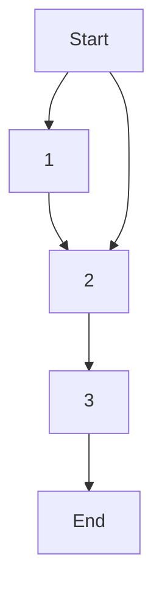

# Algofab features

## Context

This workflow covers summarily some of the most preeminent features of Algofab, namely: 

* Searching : how do you fish for a particular resource in a sea of resources with different types? 
* Downloading : how to download a resource once one feel like using / testing a particular resource?
* Uploading: how to upload resources on Algofab and share it with other users?

To highlight these features the following background will be assumed : 
_A user / researcher browsing the platform for a particular "Algorithm" type of resource that is necessary for him to continue with a scientific study (i.e. the algorithm can help resolve partially the problem posed in a the scientific study)._ 
_The researcher downloads the resource and apllies it on his own data which results in new and valuable data._
_The researcher whises to publish the generated data containing the conclusion he came up with after the study, thus he upload them as a "Dataset" type of resource._

## Outcome

More or less what is discussed in th e context section above

## Workflow component

The workflow is divided in three WFC :

* the [WFC 1](./search/index.md) : describes how searches are performed on Algofab wheter on the portal (GUI) or the API Server (REST API interface)
* the [WFC 2](./download/index.md) : describes how to download and run a targeted resource Algofab wheter on the portal (GUI) or the API Server (REST API interface)
* the [WFC 3](./upload/index.md) : describes how to upload a targeted resource Algofab wheter on the portal (GUI) or the API Server (REST API interface)

_Note: the graph empahsizes that the search part is not mandatory, that is, if you already have a resource in mind, you can just start with the download part. Also technically WFC 3 does not really depend on WFC 2 (you don't have to download a resource each time you need to upload a new one), however, we maintain that dependance to match the context of this workflow (indeed the upload data in WFC 3 were generated by the resource downloaded in WFC 2)._