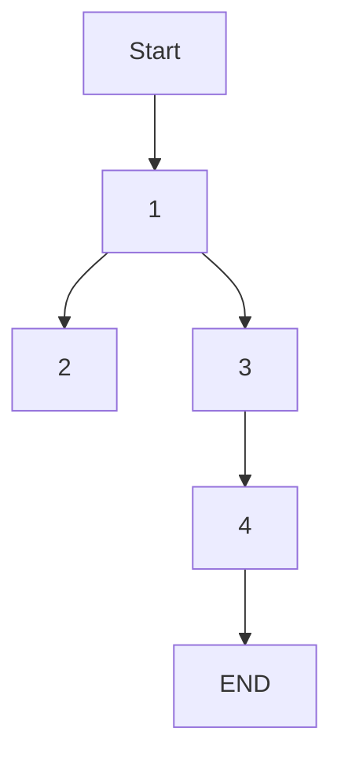

# Collaboration through TeraLab Marketplace

_**/!\ Note**: the terms "Algofab" and "TeraLab Marketplace" are interchangeable_
_**/!\ Note**: the terms "App" and "Algorithm" are interchangeable_

## Pre-requisites:

* Familiarity with the Marketplace (read the workflow [Getting Started with TeraLab Marketplace]() to get introduced)

## Context

<!-- This workflow aims to outline a particular example of collaboration between two developper teams mutually benefitting each other.

The scenario goes as follows :

* two teams, A and B, want to cooperate on a datascience project
* team A has sensitive data it cannot publish directly (i.e. legal bindings) but it can however, first process the sensitive data to produce non-sensitive and valuable data, that in turn, can be shared as to promote the results of a scientific study. For the sake of simplicity we are going to consider that the study is only dependant on one processing (algorithm) 
* team B publishes an App on TeraLab Marketplace that can produce the sort of data processing team A needed
* team A, therefore [after borwsing eventually and testing]() fetches the app then apllies it on their data
* finally team A publishes their generated data to the TeraLab Marketplace -->

This workflow aims to outline a particular example of collaboration between three data-scientists.

This is the scenario :

* Developer A shares an App (A1)
* Developer B shares a Dataset (D1)
* Developer C :
  * Downloads A1 & D1
  * Includes downloaded resources in a Datascience project
  * Generates new Dataset (D2) at the end of the project
  * Shares the Dataset D2

## Variables

The above context outlines the objectives of the workflow as well as an overview of it, let us be specific in this section. 

* App A1: [ALGORUN](https://ws67-af-portal.tl.teralab-datascience.fr/workshop/items/5fb633ea4f5aa7013ddae944)
* Dataset D1: IRIS
* Developer C's project: Train a <code>K-Means</code> model on D1 within the environement provided by A1
* Dataset D2: K-Means Model obtained 

_**/!\ Note**: Algorun creates an environment with python3, sklearn and pandas. The objective is to run sklearn algorithms / scripts_

## Outcome

* use the marketplace to run a simple datascience project

## Workflow components

This workflow has two WFC independant from each other but essential in their respective use cases: 
* the [WFC 1](./sharing1) : shows how developers A and B can share their resources,
* the [WFC 2](./searching) : developers C searching & testing the resources,
* the [WFC 3](./download): describes the download of resources + setup of the project,
* the [WFC 4](./sharing2): shows how developer C shares his results.

