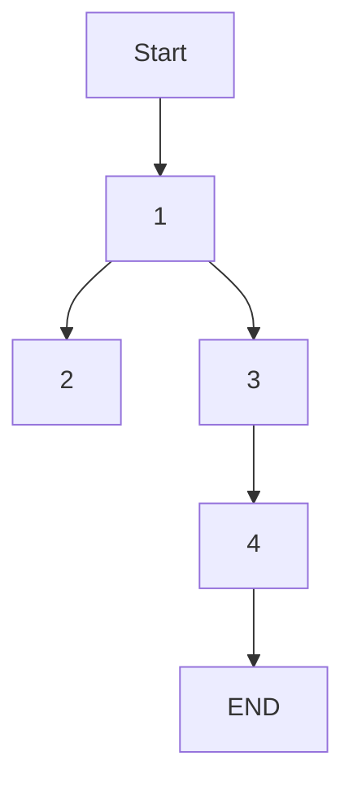

# Collaboration through TeraLab Marketplace

_**/!\ Note**: the terms "Algofab" and "TeraLab Marketplace" are interchangeable_
_**/!\ Note**: the terms "App" and "Algorithm" are interchangeable_

## Context

This workflow aims to outline a particular example of collaboration between two developper teams mutually benefitting each other.

The scenario goes as follows :

* two teams, A and B, want to cooperate on a datascience project
* team A has sensitive data it cannot publish directly (i.e. legal bindings) but it can however, first process the sensitive data to produce non-sensitive and valuable data, that in turn, can be shared as to promote the results of a scientific study. For the sake of simplicity we are going to consider that the study is only dependant on one processing (algorithm) 
* team B publishes an App on TeraLab Marketplace that can produce the sort of data processing team A needed
* team A, therefore [after borwsing eventually and testing]() fetches the app then apllies it on their data
* finally team A publishes their generated data to the TeraLab Marketplace

## Pre-requisites:

* having a basic understanding of TeraLab's Marketplace: [see the workflow](../algofab_presentation/README.md) 

## Outcome

* describing the copperation between teams in case where
* * one team provides apps and other makes use of them to generate data and both results are shared 

## Workflow components

This workflow has two WFC independant from each other but essential in their respective use cases: 
* the [WFC 1](./setup/README.md) : describes the app as well as the setup
* the [WFC 2](./workshop/README.md): describes how team A tested the app
* the [WFC 3](./download/README.md): describes how team A downloaded and the app ran it locally (in an environment team A can control)
* the [WFC 4](./publish/README.md): describes how team A published the model as a resource (read WFC 1 for more information)

