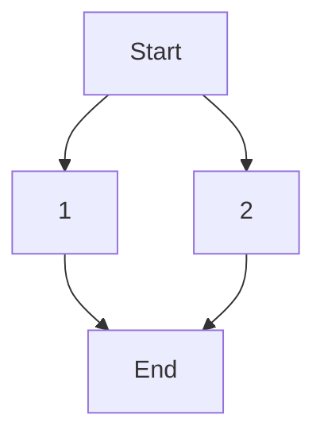

# Getting started

## Context

This workflow aims to describe a scenario in a highlighting Algofab and its most attractive features in the context of scientific studies.

[Describe Algofab a bit]

## Outcome

The workflow should allow reader to :

* have a basic understanding of Algofab
* know how to make use of the most important features of Alfgofab
* understand the structure of Algofab documentation allowing him to navigate through it and deepen his usage of the platform

## Workflow components

This workflow has two WFC indepebdabt from each other but essential in their respective use cases: 
* the [WFC 1](../algofab_features/index.md) : describes some important features in order to help better guide new users towards the resources that are most likeley to interst them.
* the [WFC 2](../algofab_mobility/index.md) : describes how, in a certain context, it might be usefull for users to create a local deployment of Algofab and how to go about deploying it.

